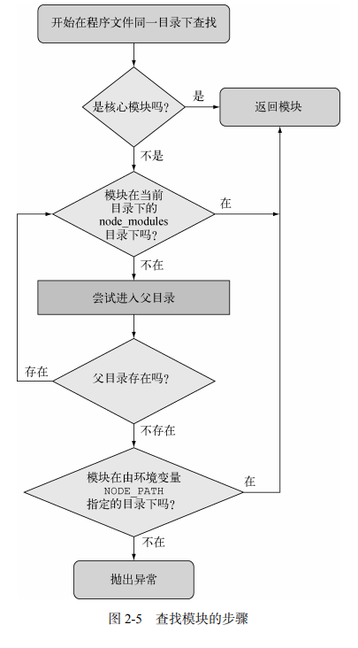

# Node.js实战第二版

## 第二章

### node应用中的require 和 exports、module.exports

#### 挂载到一个对象上导出多个

```javascript
const canadianDollar = 0.91;
function roundTwo(amount) {
 return Math.round(amount * 100) / 100;
}
// 挂载到exports上
exports.canadianToUS = canadian => roundTwo(canadian * canadianDollar);
exports.USToCanadian = us => roundTwo(us / canadianDollar); 
```

```javascript
// 引入的是一个对象
const currency = require('./currency');
console.log('50 Canadian dollars equals this amount of US dollars:');
// 调用对象上挂载的函数
console.log(currency.canadianToUS(50));
console.log('30 US dollars equals this amount of Canadian dollars:');
console.log(currency.USToCanadian(30));
```

#### 导出单个模块

```javascript
class Currency {
 constructor(canadianDollar) {
 this.canadianDollar = canadianDollar;
 }
 roundTwoDecimals(amount) {
 return Math.round(amount * 100) / 100;
 }
 canadianToUS(canadian) {
 return this.roundTwoDecimals(canadian * this.canadianDollar);
 }
 USToCanadian(us) {
 return this.roundTwoDecimals(us / this.canadianDollar);
 }
}
// 不允许想exports 赋值  这样就改变了exports的引用
// exports = Currency;
module.exports = Currency
```

#### exports 只不过是对module.exports 的引用

最终在程序里导出的是 module.exports。exports 只是对 module.exports 的一个全 局引用，最初被定义为一个可以添加属性的空对象。exports.myFunc 只是 module.exports. myFunc 的简写。

 所以，如果把 exports 设定为别的，就打破了 module.exports 和 exports 之间的引用 关系。可是因为真正导出的是 module.exports，那样 exports 就不能用了，因为它不再指向 module.exports 了。如果你想保留那个链接，可以像下面这样让 module.exports 再次引用 exports： 

module.exports = exports = Currency; 根据需要使用 exports 或 module.exports 可以将功能组织成模块，规避掉程序脚本 一直增长所产生的弊端。

### Node 模块查找机制



> 用环境变量 NODE_PATH 可以改变 Node 模块的默认路径。如果用了它，在 Windows 中 NODE_PATH 应该设置为用分号分隔的目录列表，在其他操作系统中则用冒号分隔。

